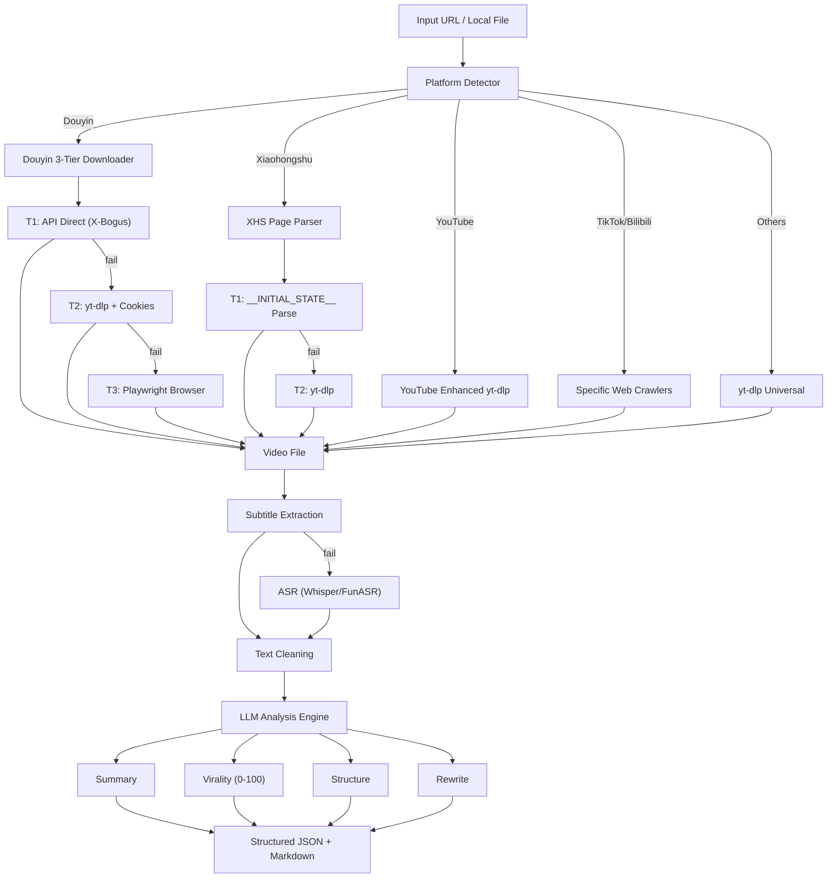

# 🎬 Go Viral Video — 视频爆款分析与改写神器

[](LICENSE)
[](https://www.python.org/downloads/)

**一个强大的跨平台视频分析与改写流水线工具。** 自动下载视频、提取文案、多维度评估爆款潜力、拆解叙事结构，并一键将内容改写为多种爆款风格。

**A powerful, multi-platform video analysis and rewriting pipeline.** Downloads videos, extracts transcripts, scores virality across 5 dimensions, breaks down narrative structure, and rewrites content into various viral styles.

> **双模式兼容 / Dual-mode**: 既可作为 **AI Skill**（被 AI Agent 调用），也可作为 **CLI 命令行工具**（人工使用）。
> Works as both an **AI Skill** (called by agents) and a **CLI Tool** (used by humans).

---

## ⚡ Skill 快速上手 / Skill Quick Start

### 1. 从 AI Agent 调用 / Call from AI Agent

```python
from skill import run_skill

result = run_skill({
    "url": "https://v.douyin.com/xxxxx",
    "mode": "full",                        # full | download | transcript | analyze
    "rewrite_modes": ["light", "viral"],
    "rewrite_styles": ["storytelling"],
})
```

### 2. 四个便捷函数 / 4 Convenience Functions

```python
from skill import analyze_video, download_video, extract_transcript, score_virality

result = analyze_video("https://v.douyin.com/xxxxx")      # 全流程分析 / Full analysis
result = download_video("https://youtube.com/watch?v=xxx") # 仅下载视频 / Download only
result = extract_transcript("https://xhslink.com/xxxxx")   # 仅提取文案 / Transcript only
result = score_virality("https://b23.tv/xxx")              # 仅评估爆款指数 / Virality score only
```

### 3. 输入输出 Schema / Input & Output Schema

**输入参数 / Input:**

| 字段 / Field | 类型 / Type | 必填 / Required | 说明 / Description |
|---|---|---|---|
| `url` | string | ✅ | 视频链接、图文笔记链接或本地文件路径 / Video URL, image/text note URL, or local file path |
| `mode` | string | ❌ | `full`（默认）, `download`, `transcript`, `analyze` |
| `output_dir` | string | ❌ | 输出目录 / Output directory (default: `./output`) |
| `asr_engine` | string | ❌ | `funasr`（默认）或 `whisper` |
| `rewrite_modes` | list | ❌ | `["light", "viral", "storytelling", "emotional", "educational", "promotional", "abstract"]` |
| `rewrite_styles` | list | ❌ | `["storytelling", "emotional", "educational", "promotional"]` |

**输出结构 / Output:**

```json
{
    "success": true,
    "mode": "full",
    "data": {
        "video": { "platform": "douyin", "title": "...", "author": "...", "duration_seconds": 30 },
        "transcript": { "source": "asr", "language": "zh", "cleaned_text": "...", "word_count": 500 },
        "summary": { "one_sentence": "...", "key_points": ["...", "..."] },
        "virality": {
            "scores": { "hook": 85, "emotion": 70, "retention": 75, "cta": 60, "social_currency": 80, "overall": 75 },
            "hook_type": "curiosity",
            "viral_potential": "high"
        },
        "structure": { "hook": {...}, "setup": {...}, "conflict": {...}, "climax": {...}, "cta": {...} },
        "rewrites": { "light": {...}, "viral": {...}, "style_variants": [...] }
    },
    "message": "Video: xxx | Virality: 75/100 (high) | Rewrites: 3 variants"
}
```

### 4. 完整示例与预期输出 / Complete Example with Expected Output

```python
from skill import run_skill

result = run_skill({
    "url": "https://v.douyin.com/iQs8eXqJLkP/",
    "mode": "full",
    "rewrite_modes": ["viral"],
    "rewrite_styles": ["storytelling"],
})

if result["success"]:
    data = result["data"]
    print(f"平台 / Platform: {data['video']['platform']}")
    print(f"标题 / Title: {data['video']['title']}")
    print(f"爆款指数 / Virality: {data['virality']['scores']['overall']}/100")
    print(f"爆款潜力 / Viral Potential: {data['virality']['viral_potential']}")
    print(f"钩子类型 / Hook Type: {data['virality']['hook_type']}")
    print(f"文案字数 / Word Count: {data['transcript']['word_count']}")
    print(f"改写版本 / Rewrites: {len(data['rewrites'])} variants")
```

**预期输出 / Expected Output:**
```
平台 / Platform: douyin
标题 / Title: 3个让你效率翻倍的AI工具
爆款指数 / Virality: 78/100
爆款潜力 / Viral Potential: high
钩子类型 / Hook Type: curiosity
文案字数 / Word Count: 485
改写版本 / Rewrites: 2 variants
```

---

## 🌟 核心亮点 / Core Selling Points

- **🛡️ 多平台下载 + 反检测 / Multi-platform Download with Anti-Detection**: 抖音三级降级策略（API → yt-dlp → Playwright），小红书 `__INITIAL_STATE__` 解析，YouTube 增强 yt-dlp
- **🌐 7 大平台支持 / 7 Platform Support**: 抖音、小红书、YouTube、TikTok、B站、Instagram、Twitter/X
- **📊 5D 爆款评分 + 叙事结构拆解 / 5D Virality Scoring + Narrative Breakdown**: 钩子、情绪、留存、CTA、社交货币五维评分，附带叙事结构分析与 Go Viral 建议
- **✍️ 多模式改写 / Multi-mode Rewrite**: 轻量、爆款、故事化、情绪化、教育型、推广型、抽象型 7 种改写模式
- **🖼️ Vision LLM 图片分析 / Vision LLM Image Analysis**: 支持小红书图文笔记、Twitter/X 图文推文的图片内容理解
- **🎤 FunASR 中文语音识别 / FunASR Chinese ASR**: 阿里 FunASR 中文优化，内置领域词表，支持 VAD 和标点恢复
- **🔌 双模式运行 / Dual-mode**: AI Skill + CLI 工具，一套代码两种用法

---

## 🏗️ 架构 / Architecture



---

## 🌐 平台支持 / Platform Support

| 平台 / Platform | 下载方式 / Download | 反爬策略 / Anti-Scraping | 字幕 / Subtitle | 特殊支持 / Special |
|---|---|---|---|---|
| **抖音 Douyin** | API → yt-dlp → Playwright | XBogus, ABogus, Cookies | ASR | 三级降级 / 3-tier fallback |
| **小红书 Xiaohongshu** | 页面解析 → yt-dlp / Page Parse → yt-dlp | `__INITIAL_STATE__` | ASR / 笔记文字 / Note Text | **图文笔记 / Image+Text Notes** |
| **YouTube** | yt-dlp 增强 / Enhanced | — | 自动字幕(中/英/日/韩) + 章节 / Auto-subs + Chapters | h264 优先 / h264 preferred |
| **TikTok** | 爬虫 + yt-dlp / Crawler + yt-dlp | XBogus | yt-dlp 自动字幕 / ASR | 短链解析 / Short URL |
| **B站 Bilibili** | 爬虫 + yt-dlp / Crawler + yt-dlp | W-RID 签名 / Signature | API 字幕 / yt-dlp | — |
| **Instagram** | yt-dlp + 页面解析 / Page Parse | — | ASR | **图文帖子 / Image+Text Posts** |
| **Twitter/X** | yt-dlp + 页面解析 / Page Parse | — | ASR / **图文推文 / Image+Text Tweets** | Vision LLM 图片分析 |

---

## 🚀 安装 / Installation

```bash
git clone https://github.com/your-org/go-viral-video.git
cd go-viral-video
pip install -r requirements.txt

# 可选依赖 / Optional
pip install openai-whisper           # ASR (English/multi-language)
pip install funasr modelscope        # ASR (Chinese optimized, recommended)
pip install playwright && playwright install chromium  # Douyin fallback
pip install browser-cookie3          # Auto-read browser cookies

cp .env.example .env                 # 编辑填入 LLM API Key / Edit with your LLM API key
```

**系统要求 / System Requirements**: FFmpeg 必须安装并加入 PATH / FFmpeg must be installed and in PATH.

---

## 💻 使用 / Usage

### 模式一：CLI 命令行工具 / Mode 1: CLI Tool (for Humans)

```bash
# 全流程分析 / Full analysis
python main.py https://www.youtube.com/watch?v=dQw4w9WgXcQ

# 分析抖音视频 / Analyze Douyin video
python main.py https://v.douyin.com/xxxxx

# 分析小红书笔记 / Analyze Xiaohongshu note
python main.py https://xhslink.com/xxxxx

# 分析 B站视频 / Analyze Bilibili video
python main.py https://b23.tv/xxx -o ./results --verbose

# 仅下载和转写 / Download + transcript only
python main.py video.mp4 --asr-mode accurate --skip-analysis

# 指定改写风格 / Specify rewrite styles
python main.py https://b23.tv/xxx --rewrite-styles storytelling emotional
```

### 模式二：AI Skill（Agent 调用）/ Mode 2: AI Skill (for Agents)

```python
from skill import run_skill

# 全流程分析 / Full analysis
result = run_skill({
    "url": "https://v.douyin.com/xxxxx",
    "mode": "full",   # full | download | transcript | analyze
})

# result["success"]  -> True/False
# result["data"]     -> 完整分析结果 / Full AnalysisResult dict
# result["message"]  -> 可读摘要 / Human-readable summary
```

### 模式 2b：Python 库函数 / Mode 2b: Python Library

```python
from skill import analyze_video, download_video, extract_transcript, score_virality

result = analyze_video("https://www.youtube.com/watch?v=xxx")
result = download_video("https://v.douyin.com/xxxxx")
result = extract_transcript("https://xhslink.com/xxxxx")
result = score_virality("https://b23.tv/xxx")
```

### 四种执行模式 / 4 Execution Modes

| 模式 / Mode | 下载 / Download | 转写 / Transcript | LLM 分析 / Analysis | 改写 / Rewrite | 适用场景 / Use Case |
|---|---|---|---|---|---|
| `full` | ✅ | ✅ | ✅ | ✅ | 完整分析流水线 / Complete pipeline |
| `analyze` | ✅ | ✅ | ✅ | ❌ | 只分析不改写 / Analysis only |
| `transcript` | ✅ | ✅ | ❌ | ❌ | 只需要文案文本 / Transcript only |
| `download` | ✅ | ❌ | ❌ | ❌ | 只需要下载视频 / Download only |

---

## 🎤 ASR 设置 / ASR Setup

项目支持两种语音识别引擎。**中文内容推荐使用 FunASR。**
The project supports two ASR engines. **FunASR is recommended for Chinese content.**

### 选项 A：FunASR（中文推荐）/ Option A: FunASR (Recommended for Chinese)

FunASR 是阿里的开源语音识别工具，针对中文优化，内置 VAD 和标点恢复。
FunASR is Alibaba's open-source speech recognition toolkit, optimized for Chinese with built-in VAD and punctuation recovery.

```bash
pip install funasr modelscope torchaudio

# 首次运行自动下载模型（约 2GB）/ First run auto-downloads models (~2GB):
# - paraformer-zh (ASR 模型 / ASR model)
# - fsmn-vad (语音活动检测 / Voice Activity Detection)
# - ct-punc (标点恢复 / Punctuation recovery)
```

**使用 / Usage:**
```bash
# 默认即为 FunASR / FunASR is the default engine
python main.py https://v.douyin.com/xxxxx

# 显式指定 FunASR / Explicitly specify FunASR
python main.py https://v.douyin.com/xxxxx --asr-engine funasr
```

**性能 / Performance**: 2 分钟视频约 8-10 秒，RTF ~0.07，内存 ~2-3GB。
~8-10 seconds for a 2-minute video, RTF ~0.07, memory ~2-3GB.

### 选项 B：Whisper（多语言）/ Option B: Whisper (Multi-language)

```bash
pip install openai-whisper

# 使用 / Usage
python main.py https://www.youtube.com/watch?v=xxx --asr-engine whisper
python main.py https://v.douyin.com/xxxxx --asr-engine whisper --asr-mode accurate
```

**模式 / Modes:**
- `fast`: Whisper base 模型 / model (~139MB, 快速 / fast, 精度较低 / lower accuracy)
- `accurate`: Whisper large-v3 (~3GB, 较慢 / slower, 精度更高 / higher accuracy)

### ASR 配置 / ASR Configuration

在 `.env` 中添加 / Add to `.env`:
```ini
ASR_ENGINE=funasr        # funasr (recommended) or whisper
ASR_MODE=fast            # fast or accurate (whisper only)
```

---

## 🍪 Cookie 配置 / Cookie Configuration

抖音有严格的反爬机制。配置浏览器 Cookie 可确保最高下载成功率（使用 T1/T2 接口直接下载无水印原画）。
Douyin aggressively blocks unauthenticated scraping. Providing browser cookies ensures the highest download success rate (API T1/T2 direct download).

### ✨ 方法一：自动读取（推荐）/ Method 1: Automatic Extraction (Recommended)

```bash
pip install browser-cookie3
```

安装后，程序会自动安全读取本地 Chrome/Edge 浏览器的抖音 Cookie，无需手动配置。
Once installed, the pipeline automatically and securely reads your local Chrome/Edge cookies for `douyin.com`. No manual configuration needed!

### ⚙️ 方法二：手动配置 / Method 2: Manual Configuration (.env file)

如果在服务器上运行，需手动提供 Cookie。
If running on a server, you must provide cookies manually.

1. 打开 Chrome/Edge，访问 `https://www.douyin.com` / Open Chrome/Edge and go to `https://www.douyin.com`
2. 登录账号（强烈建议）/ Login to your account (optional but highly recommended)
3. 按 `F12` 打开开发者工具 → **Application**（或 **Storage**）标签 / Press `F12` → **Application** (or **Storage**) tab
4. 左侧展开 **Cookies** → 点击 `https://www.douyin.com` / Expand **Cookies** → click `https://www.douyin.com`
5. 找到以下键的值并复制到 `.env` / Find the values for these keys and copy to `.env`:
   - `ttwid` → `DOUYIN_COOKIE_TTWID`
   - `odin_tt` → `DOUYIN_COOKIE_ODIN_TT`
   - `passport_csrf_token` → `DOUYIN_COOKIE_CSRF_TOKEN`
   - `sessionid` → `DOUYIN_COOKIE_SESSIONID`（登录后才有 / available after login）

```ini
DOUYIN_COOKIE_TTWID=1%7Cxxxxxx
DOUYIN_COOKIE_ODIN_TT=xxxxxx
DOUYIN_COOKIE_CSRF_TOKEN=xxxxxx
DOUYIN_COOKIE_SESSIONID=xxxxxx
```

---

## 📋 输出示例 / Output Examples

### JSON 输出 / JSON Output (`analysis_result.json`)

```json
{
  "video": {
    "platform": "douyin",
    "title": "3个让你效率翻倍的AI工具",
    "author": "@AI达人",
    "duration_seconds": 45
  },
  "transcript": {
    "source": "asr",
    "language": "zh",
    "cleaned_text": "今天给大家分享三个超好用的AI工具...",
    "word_count": 485
  },
  "summary": {
    "one_sentence": "介绍三款提升工作效率的AI工具及其核心功能",
    "key_points": ["工具一：智能写作助手", "工具二：自动PPT生成", "工具三：会议纪要AI"]
  },
  "virality": {
    "scores": {
      "hook": 85,
      "emotion": 70,
      "retention": 75,
      "cta": 60,
      "social_currency": 80,
      "overall": 75
    },
    "hook_type": "curiosity",
    "viral_potential": "high",
    "go_viral_advice": "开头钩子很强，建议在30秒处增加互动提问提升留存"
  },
  "structure": {
    "hook": { "text": "今天给大家分享...", "timestamp": "0:00-0:05", "technique": "curiosity_gap" },
    "setup": { "text": "第一个工具是...", "timestamp": "0:05-0:15" },
    "conflict": { "text": "很多人不知道的是...", "timestamp": "0:15-0:25" },
    "climax": { "text": "最厉害的功能是...", "timestamp": "0:25-0:35" },
    "cta": { "text": "点赞收藏，下期继续分享", "timestamp": "0:40-0:45" }
  },
  "rewrites": {
    "light": { "title": "...", "script": "..." },
    "viral": { "title": "...", "script": "..." },
    "style_variants": [
      { "style": "storytelling", "title": "...", "script": "..." },
      { "style": "emotional", "title": "...", "script": "..." }
    ]
  }
}
```

### Markdown 报告 / Markdown Report (`analysis_report.md`)

```markdown
# 📊 视频分析报告 / Video Analysis Report

## 基本信息 / Basic Info
- **平台 / Platform**: 抖音
- **标题 / Title**: 3个让你效率翻倍的AI工具
- **作者 / Author**: @AI达人
- **时长 / Duration**: 45秒

## 📈 爆款评分 / Virality Score: 75/100 (High)

| 维度 / Dimension | 分数 / Score |
|---|---|
| 钩子 / Hook | 85 |
| 情绪 / Emotion | 70 |
| 留存 / Retention | 75 |
| CTA | 60 |
| 社交货币 / Social Currency | 80 |

## 💡 Go Viral 建议 / Go Viral Advice
开头钩子很强，建议在30秒处增加互动提问提升留存。

## ✍️ 改写版本 / Rewrites
### 爆款模式 / Viral Mode
**标题**: 打工人必看！这3个AI工具让我每天少加班2小时...
**正文**: [改写后的完整文案]
```

---

## 🔧 故障排查 / Troubleshooting

### FFmpeg 未找到 / FFmpeg not found
**错误 / Error**: `ffmpeg not found`
**解决 / Solution**:
- Windows: `choco install ffmpeg` 或从 https://ffmpeg.org/ 下载
- macOS: `brew install ffmpeg`
- Linux: `sudo apt install ffmpeg`

### LLM API 认证失败 / LLM API authentication failed
**错误 / Error**: `Authentication error` 或 `Invalid API key`
**解决 / Solution**:
1. 检查 `.env` 中的 `LLM_API_KEY` / Check `LLM_API_KEY` in `.env`
2. 确认 `LLM_BASE_URL` 正确 / Verify `LLM_BASE_URL` is correct
3. 测试 / Test: `curl -H "Authorization: Bearer $LLM_API_KEY" $LLM_BASE_URL/models`

### 抖音下载失败 / Douyin download fails
**错误 / Error**: `All Douyin download methods failed`
**解决 / Solution**:
1. 在 `.env` 中配置 Cookie / Configure cookies: `DOUYIN_COOKIE_TTWID=...`
2. 使用代理 / Try proxy: `--proxy http://127.0.0.1:7890`
3. 更新 yt-dlp / Update yt-dlp: `pip install -U yt-dlp`

### YouTube 403 禁止 / YouTube 403 Forbidden
**错误 / Error**: `HTTP Error 403: Forbidden`
**解决 / Solution**: 使用代理或浏览器 Cookie / Use proxy or browser cookies: `--cookies-from-browser chrome`

### FunASR 模型下载卡住 / FunASR model download stuck
**解决 / Solution**: 模型从 ModelScope 下载，如在中国大陆请使用代理 / Models are from ModelScope, use a proxy if in mainland China.

### 长视频内存不足 / Out of memory with long videos
**解决 / Solution**: 流水线自动分段处理 >5 分钟视频。超长视频可在配置中增大 chunk 大小 / Pipeline auto-chunks videos >5min. Increase chunk size in config for very long videos.

### 缓存问题 / Cache issues
**解决 / Solution**: 清除缓存 / Clear cache: `rm -rf output/.cache/`

---

## 📜 开源协议 / License

Apache-2.0 License. 详情请参阅 `LICENSE` 文件。
See [LICENSE](LICENSE) for details.
