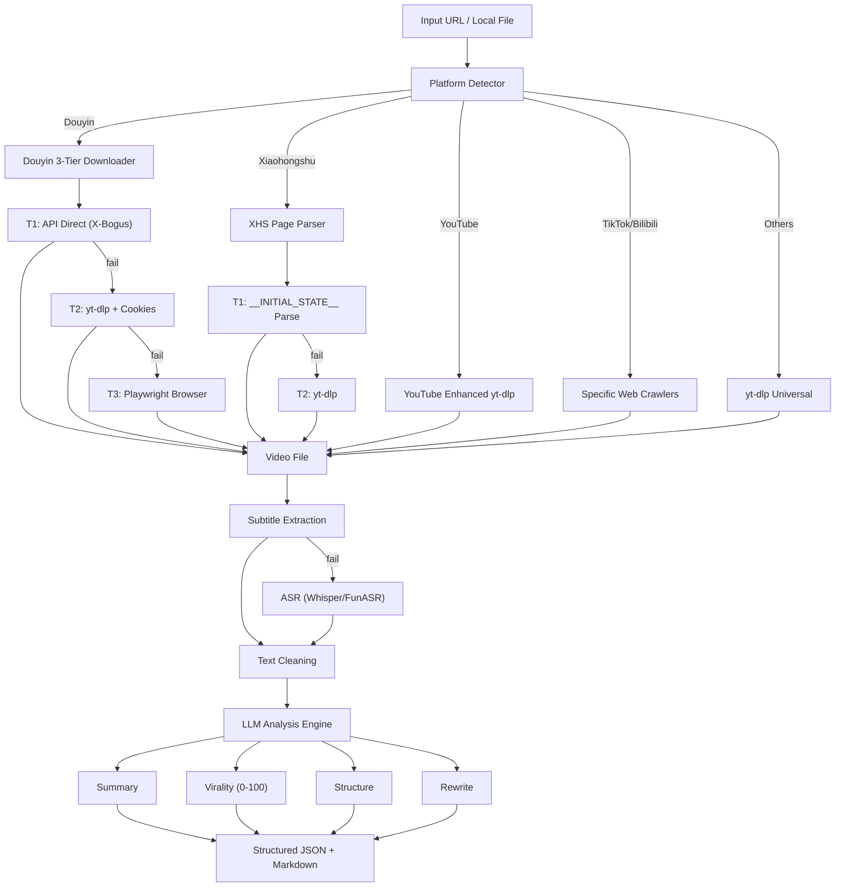

# 🎬 Go Viral Video

[](LICENSE)
[](https://www.python.org/downloads/)

<div align="center">

[🇨🇳 中文版](README.zh-CN.md)

</div>

---

A powerful, multi-platform video analysis and rewriting pipeline. Downloads videos, extracts transcripts, scores virality across 5 dimensions, breaks down narrative structure, and rewrites content into various viral styles.

> **Dual-mode**: Works as both an **AI Skill** (called by agents) and a **CLI Tool** (used by humans).

## ⚡ Quick Start

### Call from AI Agent

```python
from skill import run_skill

result = run_skill({
    "url": "https://v.douyin.com/xxxxx",
    "mode": "full",                        # full | download | transcript | analyze
    "rewrite_modes": ["light", "viral"],
    "rewrite_styles": ["storytelling"],
})
```

### 4 Convenience Functions

```python
from skill import analyze_video, download_video, extract_transcript, score_virality

result = analyze_video("https://v.douyin.com/xxxxx")      # Full analysis
result = download_video("https://youtube.com/watch?v=xxx") # Download only
result = extract_transcript("https://xhslink.com/xxxxx")   # Transcript only
result = score_virality("https://b23.tv/xxx")              # Virality score only
```

### Input & Output Schema

**Input:**

| Field | Type | Required | Description |
|---|---|---|---|
| `url` | string | ✅ | Video URL, image/text note URL, or local file path |
| `mode` | string | ❌ | `full` (default), `download`, `transcript`, `analyze` |
| `output_dir` | string | ❌ | Output directory (default: `./output`) |
| `asr_engine` | string | ❌ | `funasr` (default) or `whisper` |
| `rewrite_modes` | list | ❌ | `["light", "viral", "storytelling", "emotional", "educational", "promotional", "abstract", "prep", "scqa"]` |
| `rewrite_styles` | list | ❌ | `["storytelling", "emotional", "educational", "promotional", "prep", "scqa"]` |

**Output:**

```json
{
    "success": true,
    "mode": "full",
    "data": {
        "video": { "platform": "douyin", "title": "...", "author": "...", "duration_seconds": 30 },
        "transcript": { "source": "asr", "language": "zh", "cleaned_text": "...", "word_count": 500 },
        "summary": { "one_sentence": "...", "key_points": ["...", "..."] },
        "virality": {
            "scores": { "hook": 85, "emotion": 70, "retention": 75, "cta": 60, "social_currency": 80, "overall": 75 },
            "hook_type": "curiosity",
            "viral_potential": "high"
        },
        "structure": { "hook": {...}, "setup": {...}, "conflict": {...}, "climax": {...}, "cta": {...} },
        "rewrites": { "light": {...}, "viral": {...}, "style_variants": [...] }
    },
    "message": "Video: xxx | Virality: 75/100 (high) | Rewrites: 3 variants"
}
```

### Complete Example

```python
from skill import run_skill

result = run_skill({
    "url": "https://v.douyin.com/iQs8eXqJLkP/",
    "mode": "full",
    "rewrite_modes": ["viral"],
    "rewrite_styles": ["storytelling"],
})

if result["success"]:
    data = result["data"]
    print(f"Platform: {data['video']['platform']}")
    print(f"Title: {data['video']['title']}")
    print(f"Virality: {data['virality']['scores']['overall']}/100")
    print(f"Viral Potential: {data['virality']['viral_potential']}")
    print(f"Hook Type: {data['virality']['hook_type']}")
    print(f"Word Count: {data['transcript']['word_count']}")
    print(f"Rewrites: {len(data['rewrites'])} variants")
```

**Expected Output:**
```
Platform: douyin
Title: 3 AI Tools to Double Your Efficiency
Virality: 78/100
Viral Potential: high
Hook Type: curiosity
Word Count: 485
Rewrites: 2 variants
```

---

## 🌟 Core Features

- **🛡️ Multi-platform Download with Anti-Detection**: Douyin 3-tier fallback (API → yt-dlp → Playwright), Xiaohongshu `__INITIAL_STATE__` parsing, YouTube enhanced yt-dlp
- **🌐 7 Platform Support**: Douyin, Xiaohongshu, YouTube, TikTok, Bilibili, Instagram, Twitter/X
- **📊 5D Virality Scoring + Narrative Breakdown**: Hook, Emotion, Retention, CTA, Social Currency with Go Viral advice
- **✍️ Multi-mode Rewrite**: Light, Viral, Storytelling, Emotional, Educational, Promotional, Abstract, PREP (Point-Reason-Example-Point), SCQA (Situation-Conflict-Question-Answer) — 9 rewrite styles
- **🖼️ Vision LLM Image Analysis**: Supports Xiaohongshu image+text notes and Twitter/X image+text tweets
- **🎤 FunASR Chinese ASR**: Alibaba's FunASR optimized for Chinese, with domain vocabulary, VAD, and punctuation recovery
- **🔌 Dual-mode**: AI Skill + CLI tool, one codebase two usages

## 🏗️ Architecture



## 🌐 Platform Support

| Platform | Download | Anti-Scraping | Subtitle | Special |
|---|---|---|---|---|
| **Douyin** | API → yt-dlp → Playwright | XBogus, ABogus, Cookies | ASR | 3-tier fallback |
| **Xiaohongshu** | Page Parse → yt-dlp | `__INITIAL_STATE__` | ASR / Note Text | **Image+Text Notes** |
| **YouTube** | Enhanced yt-dlp | — | Auto-subs (CN/EN/JP/KR) + Chapters | h264 preferred |
| **TikTok** | Crawler + yt-dlp | XBogus | yt-dlp auto-subs / ASR | Short URL parsing |
| **Bilibili** | Crawler + yt-dlp | W-RID Signature | API subs / yt-dlp | — |
| **Instagram** | yt-dlp + Page Parse | — | ASR | **Image+Text Posts** |
| **Twitter/X** | yt-dlp + Page Parse | — | ASR / **Image+Text Tweets** | Vision LLM image analysis |

## 🚀 Installation

```bash
git clone https://github.com/your-org/go-viral-video.git
cd go-viral-video
pip install -r requirements.txt

# Optional dependencies
pip install openai-whisper           # ASR (English/multi-language)
pip install funasr modelscope        # ASR (Chinese optimized, recommended)
pip install playwright && playwright install chromium  # Douyin fallback
pip install browser-cookie3          # Auto-read browser cookies

cp .env.example .env                 # Edit with your LLM API key
```

**System Requirements**: FFmpeg must be installed and in PATH.

## 💻 Usage

### Mode 1: CLI Tool (for Humans)

```bash
# Full analysis
python main.py https://www.youtube.com/watch?v=dQw4w9WgXcQ

# Analyze Douyin video
python main.py https://v.douyin.com/xxxxx

# Analyze Xiaohongshu note
python main.py https://xhslink.com/xxxxx

# Analyze Bilibili video
python main.py https://b23.tv/xxx -o ./results --verbose

# Download + transcript only
python main.py video.mp4 --asr-mode accurate --skip-analysis

# Specify rewrite styles
python main.py https://b23.tv/xxx --rewrite-styles storytelling emotional
```

### Mode 2: AI Skill (for Agents)

```python
from skill import run_skill

# Full analysis
result = run_skill({
    "url": "https://v.douyin.com/xxxxx",
    "mode": "full",   # full | download | transcript | analyze
})

# result["success"]  -> True/False
# result["data"]     -> Full AnalysisResult dict
# result["message"]  -> Human-readable summary
```

### Mode 2b: Python Library

```python
from skill import analyze_video, download_video, extract_transcript, score_virality

result = analyze_video("https://www.youtube.com/watch?v=xxx")
result = download_video("https://v.douyin.com/xxxxx")
result = extract_transcript("https://xhslink.com/xxxxx")
result = score_virality("https://b23.tv/xxx")
```

### 4 Execution Modes

| Mode | Download | Transcript | LLM Analysis | Rewrite | Use Case |
|---|---|---|---|---|---|
| `full` | ✅ | ✅ | ✅ | ✅ | Complete pipeline |
| `analyze` | ✅ | ✅ | ✅ | ❌ | Analysis only |
| `transcript` | ✅ | ✅ | ❌ | ❌ | Transcript only |
| `download` | ✅ | ❌ | ❌ | ❌ | Download only |

### Rewrite Styles Reference

| Style | Description | Best For |
|---|---|---|
| `light` | Light touch-up, preserves original structure | Good-quality originals needing minor optimization |
| `viral` | Viral boost, amplifies hooks and emotional tension | Maximizing reach and engagement |
| `storytelling` | Story-driven narrative, plot captivates audience | Knowledge sharing, personal branding |
| `emotional` | Emotion-driven, triggers empathy and resonance | Emotional/inspirational content |
| `educational` | Educational output, clear and logical | Tutorials, how-to content |
| `promotional` | Promotional copy, highlights selling points and CTA | Product marketing, sales content |
| `abstract` | Abstract distillation, high-level summary | Brand philosophy, opinion pieces |
| `prep` | **PREP Framework**: Point → Reason → Example → Point loop, builds persuasion through logical closure | Persuasive content needing trust |
| `scqa` | **SCQA Framework**: Situation → Conflict → Question → Answer, narrative driven by conflict | Problem-solving content without preaching |

## 🎤 ASR Setup

The project supports two ASR engines. **FunASR is recommended for Chinese content.**

### Option A: FunASR (Recommended for Chinese)

FunASR is Alibaba's open-source speech recognition toolkit, optimized for Chinese with built-in VAD and punctuation recovery.

```bash
pip install funasr modelscope torchaudio

# First run auto-downloads models (~2GB):
# - paraformer-zh (ASR model)
# - fsmn-vad (Voice Activity Detection)
# - ct-punc (Punctuation recovery)
```

**Usage:**
```bash
# FunASR is the default engine
python main.py https://v.douyin.com/xxxxx

# Explicitly specify FunASR
python main.py https://v.douyin.com/xxxxx --asr-engine funasr
```

**Performance**: ~8-10 seconds for a 2-minute video, RTF ~0.07, memory ~2-3GB.

### Option B: Whisper (Multi-language)

```bash
pip install openai-whisper

# Usage
python main.py https://www.youtube.com/watch?v=xxx --asr-engine whisper
python main.py https://v.douyin.com/xxxxx --asr-engine whisper --asr-mode accurate
```

**Modes:**
- `fast`: Whisper base model (~139MB, fast, lower accuracy)
- `accurate`: Whisper large-v3 (~3GB, slower, higher accuracy)

### ASR Configuration

Add to `.env`:
```ini
ASR_ENGINE=funasr        # funasr (recommended) or whisper
ASR_MODE=fast            # fast or accurate (whisper only)
```

## 🍪 Cookie Configuration

Douyin aggressively blocks unauthenticated scraping. Providing browser cookies ensures the highest download success rate (API T1/T2 direct download without watermark).

### Method 1: Automatic Extraction (Recommended)

```bash
pip install browser-cookie3
```

Once installed, the pipeline automatically and securely reads your local Chrome/Edge cookies for `douyin.com`. No manual configuration needed!

### Method 2: Manual Configuration (.env file)

If running on a server, you must provide cookies manually.

1. Open Chrome/Edge and go to `https://www.douyin.com`
2. Login to your account (optional but highly recommended)
3. Press `F12` → **Application** (or **Storage**) tab
4. Expand **Cookies** → click `https://www.douyin.com`
5. Find the values for these keys and copy to `.env`:
   - `ttwid` → `DOUYIN_COOKIE_TTWID`
   - `odin_tt` → `DOUYIN_COOKIE_ODIN_TT`
   - `passport_csrf_token` → `DOUYIN_COOKIE_CSRF_TOKEN`
   - `sessionid` → `DOUYIN_COOKIE_SESSIONID` (available after login)

```ini
DOUYIN_COOKIE_TTWID=1%7Cxxxxxx
DOUYIN_COOKIE_ODIN_TT=xxxxxx
DOUYIN_COOKIE_CSRF_TOKEN=xxxxxx
DOUYIN_COOKIE_SESSIONID=xxxxxx
```

## 📋 Output Examples

### JSON Output (`analysis_result.json`)

```json
{
  "video": {
    "platform": "douyin",
    "title": "3 AI Tools to Double Your Efficiency",
    "author": "@AIExpert",
    "duration_seconds": 45
  },
  "transcript": {
    "source": "asr",
    "language": "zh",
    "cleaned_text": "Today I'm sharing three super useful AI tools...",
    "word_count": 485
  },
  "summary": {
    "one_sentence": "Introduces three AI tools for boosting work efficiency and their core features",
    "key_points": ["Tool 1: Smart Writing Assistant", "Tool 2: Auto PPT Generator", "Tool 3: AI Meeting Notes"]
  },
  "virality": {
    "scores": {
      "hook": 85,
      "emotion": 70,
      "retention": 75,
      "cta": 60,
      "social_currency": 80,
      "overall": 75
    },
    "hook_type": "curiosity",
    "viral_potential": "high",
    "go_viral_advice": "Strong opening hook. Consider adding an interactive question around 30s to improve retention."
  },
  "structure": {
    "hook": { "text": "Today I'm sharing...", "timestamp": "0:00-0:05", "technique": "curiosity_gap" },
    "setup": { "text": "The first tool is...", "timestamp": "0:05-0:15" },
    "conflict": { "text": "What many people don't know is...", "timestamp": "0:15-0:25" },
    "climax": { "text": "The most amazing feature is...", "timestamp": "0:25-0:35" },
    "cta": { "text": "Like and save for more next time", "timestamp": "0:40-0:45" }
  },
  "rewrites": {
    "light": { "title": "...", "script": "..." },
    "viral": { "title": "...", "script": "..." },
    "style_variants": [
      { "style": "storytelling", "title": "...", "script": "..." },
      { "style": "emotional", "title": "...", "script": "..." }
    ]
  }
}
```

### Markdown Report (`analysis_report.md`)

```markdown
# 📊 Video Analysis Report

## Basic Info
- **Platform**: Douyin
- **Title**: 3 AI Tools to Double Your Efficiency
- **Author**: @AIExpert
- **Duration**: 45 seconds

## 📈 Virality Score: 75/100 (High)

| Dimension | Score |
|---|---|
| Hook | 85 |
| Emotion | 70 |
| Retention | 75 |
| CTA | 60 |
| Social Currency | 80 |

## 💡 Go Viral Advice
Strong opening hook. Consider adding an interactive question around 30s to improve retention.

## ✍️ Rewrites
### Viral Mode
**Title**: Workers Must See! These 3 AI Tools Saved Me 2 Hours of Overtime Daily...
**Script**: [Full rewritten script]
```

## 🔧 Troubleshooting

### FFmpeg not found
**Error**: `ffmpeg not found`
**Solution**:
- Windows: `choco install ffmpeg` or download from https://ffmpeg.org/
- macOS: `brew install ffmpeg`
- Linux: `sudo apt install ffmpeg`

### LLM API authentication failed
**Error**: `Authentication error` or `Invalid API key`
**Solution**:
1. Check `LLM_API_KEY` in `.env`
2. Verify `LLM_BASE_URL` is correct
3. Test: `curl -H "Authorization: Bearer $LLM_API_KEY" $LLM_BASE_URL/models`

### Douyin download fails
**Error**: `All Douyin download methods failed`
**Solution**:
1. Configure cookies in `.env`: `DOUYIN_COOKIE_TTWID=...`
2. Try proxy: `--proxy http://127.0.0.1:7890`
3. Update yt-dlp: `pip install -U yt-dlp`

### YouTube 403 Forbidden
**Error**: `HTTP Error 403: Forbidden`
**Solution**: Use proxy or browser cookies: `--cookies-from-browser chrome`

### FunASR model download stuck
**Solution**: Models are downloaded from ModelScope. Use a proxy if in mainland China.

### Out of memory with long videos
**Solution**: Pipeline auto-chunks videos >5min. Increase chunk size in config for very long videos.

### Cache issues
**Solution**: Clear cache: `rm -rf output/.cache/`

## 📜 License

Apache-2.0 License. See [LICENSE](LICENSE) for details.
