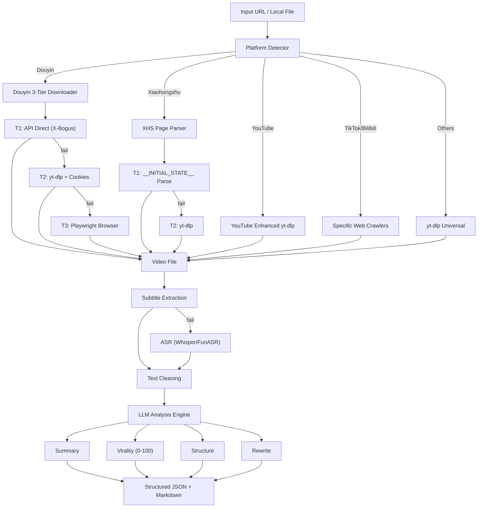

# Video Viral Analyzer & Rewriter

[](LICENSE)
[](https://www.python.org/downloads/)

A powerful, multi-platform video analysis and rewriting pipeline. Downloads videos, extracts subtitles, scores virality across 5 dimensions, breaks down narrative structure, and rewrites content into various viral styles.

> **Dual-mode**: Works as both an **AI Skill** (called by agents) and a **CLI Tool** (used by humans).

[中文文档](README.zh-CN.md)

## 🌟 Architecture



## 🎯 Platform Support

| Platform | Download Method | Subtitle | Notes |
|----------|----------------|----------|-------|
| **抖音 (Douyin)** | API Direct → yt-dlp → Playwright | ASR | XBogus/ABogus signed |
| **小红书 (Xiaohongshu)** | Page Parse → yt-dlp | ASR / Text Note / **Image+Text** | `__INITIAL_STATE__` extraction, **Vision LLM for images** |
| **YouTube** | yt-dlp Enhanced | Auto-sub (zh/en/ja/ko) + Chapters | h264 preferred |
| **TikTok** | Crawler + yt-dlp | yt-dlp auto-sub / ASR | Short URL resolution |
| **Bilibili** | Crawler + yt-dlp | API subtitle / yt-dlp | W-RID signature |
| **Instagram** | yt-dlp | ASR | Reels supported |
| **Twitter/X** | yt-dlp → Page Parse | ASR / **Image+Text** | Video + image/text tweets, **Vision LLM for images** |

### 🖼️ Xiaohongshu Image/Text Notes

The pipeline fully supports Xiaohongshu image+text notes (图文笔记):

1. **Text Extraction**: Extracts title, description, and hashtags from the note
2. **Image Analysis**: Uses vision-capable LLM (qwen3.6-plus, gpt-4o, etc.) to analyze images
3. **Combined Output**: Merges text and image analysis for complete content understanding

### 🐦 Twitter/X Image/Text Notes

The pipeline also supports Twitter/X tweets with images (图文推文):

1. **Metadata Extraction**: Uses yt-dlp `--dump-json` to fetch tweet metadata without downloading
2. **Text Extraction**: Extracts tweet body text from the metadata
3. **Image Analysis**: Uses vision-capable LLM to analyze attached images
4. **Video Tweets**: For video tweets, downloads the video and proceeds with ASR/subtitle extraction

**Requirements for Image Analysis:**
- Use a vision-capable LLM model (e.g., `qwen3.6-plus`, `qwen-vl-max`, `gpt-4o`, `kimi-k2`)
- Configure in `.env`:
  ```ini
  LLM_MODEL=qwen3.6-plus
  LLM_BASE_URL=https://coding.dashscope.aliyuncs.com/v1
  ```

**Example Output:**
```
[图片内容分析]
图片展示了阿里云百炼平台关于"Coding Plan Lite 基础套餐停止续费和升级"的官方通知。
1. 主要内容：宣布自2026年4月13日起...
2. 文字内容：包含标题、发布时间...
3. 风格色调：白底黑字的简洁商务通知风格...
4. 传达信息：结合文案背景...
```

## 🚀 Installation

```bash
git clone https://github.com/your-org/go-viral-video.git
cd go-viral-video
pip install -r requirements.txt

# Optional
pip install openai-whisper           # ASR (English/multi-language)
pip install funasr modelscope        # ASR (Chinese optimized, recommended)
pip install playwright && playwright install chromium  # Douyin fallback

cp .env.example .env                 # Edit with your LLM API key
```

**System Requirements:** FFmpeg must be installed and in PATH.

### 🎤 ASR Engine Setup

The project supports two ASR engines. **FunASR is recommended for Chinese content.**

#### Option A: FunASR (Recommended for Chinese)

FunASR is Alibaba's open-source speech recognition toolkit, optimized for Chinese with built-in VAD and punctuation recovery.

```bash
# Install dependencies
pip install funasr modelscope torchaudio

# First run will auto-download models (~2GB total):
# - paraformer-zh (ASR model)
# - fsmn-vad (Voice Activity Detection)
# - ct-punc (Punctuation recovery)
```

**Usage:**
```bash
# Default (FunASR is now the default engine)
python main.py https://v.douyin.com/xxxxx

# Explicitly specify FunASR
python main.py https://v.douyin.com/xxxxx --asr-engine funasr
```

**Performance:** ~8-10 seconds for a 2-minute video, RTF (Real Time Factor) ~0.07, memory ~2-3GB.

#### Option B: Whisper (Multi-language)

```bash
pip install openai-whisper

# Usage
python main.py https://www.youtube.com/watch?v=xxx --asr-engine whisper
python main.py https://v.douyin.com/xxxxx --asr-engine whisper --asr-mode accurate
```

**Modes:**
- `fast`: Whisper base model (~139MB, fast, lower accuracy)
- `accurate`: Whisper large-v3 (~3GB, slower, higher accuracy)

#### ASR Configuration

Add to `.env`:
```ini
# ASR Configuration
ASR_ENGINE=funasr        # funasr (recommended) or whisper
ASR_MODE=fast            # fast or accurate (whisper only)
```

### 🗄️ Caching

Analysis results are cached to avoid re-processing the same URL. Cache is stored in `./output/.cache/`.

- **Default TTL**: 24 hours
- **Clear cache**: Delete the `.cache` directory or run `ContentCache(cache_dir).clear()`
- **Cache stats**: `ContentCache(cache_dir).stats()` returns count and size

### 📦 Long Video Processing

For videos longer than 5 minutes, the pipeline can split audio into chunks for memory-efficient ASR processing:

```python
from modules.chunk_processor import ChunkProcessor

processor = ChunkProcessor(chunk_duration_seconds=300, overlap_seconds=5)
chunks = processor.split_audio("video.wav", output_dir)
text_chunks = processor.split_text_by_tokens(long_text, max_tokens=30000)
```

### 🔍 Pipeline Metrics

The pipeline collects execution metrics automatically:

```python
from metrics import metrics

# After pipeline.run():
print(metrics.get_summary())
# {'total_runs': 1, 'success_rate': '100.0%', 'avg_processing_time': '45.2s', ...}
```

Add to `.env`:
```ini
# ASR Configuration
ASR_ENGINE=funasr        # funasr (recommended) or whisper
ASR_MODE=fast            # fast or accurate (whisper only)
```

### 🍪 How to Configure Cookies (Crucial for Douyin)

Douyin aggressively blocks unauthenticated scraping. To ensure the highest success rate and speed (API T1/T2), you need to provide browser cookies.

**✨ Method 1: Automatic Extraction (Recommended)**
Simply install the optional dependency `browser-cookie3`:
```bash
pip install browser-cookie3
```
If this is installed, the pipeline will automatically securely read your local Chrome/Edge cookies for `douyin.com` when running on your machine. No manual configuration needed!

**⚙️ Method 2: Manual Configuration (.env file)**
If you are running this on a server, you must provide cookies manually.
1. Open Chrome/Edge and go to `https://www.douyin.com`.
2. Login to your account (optional but highly recommended for better stability).
3. Press `F12` to open Developer Tools, go to the **Application** (or **Storage**) tab.
4. Expand **Cookies** on the left panel and click on `https://www.douyin.com`.
5. Find the values for the following keys and copy them into your `.env` file:
   - `ttwid`
   - `odin_tt`
   - `passport_csrf_token` (mapped to `DOUYIN_COOKIE_CSRF_TOKEN`)
   - `sessionid` (if logged in)

Your `.env` should look like this:
```ini
DOUYIN_COOKIE_TTWID=1%7Cxxxxxx
DOUYIN_COOKIE_ODIN_TT=xxxxxx
DOUYIN_COOKIE_CSRF_TOKEN=xxxxxx
DOUYIN_COOKIE_SESSIONID=xxxxxx
```

## 💻 Usage

### Mode 1: CLI Tool (for Humans)

```bash
python main.py https://www.youtube.com/watch?v=dQw4w9WgXcQ
python main.py https://v.douyin.com/xxxxx
python main.py https://xhslink.com/xxxxx
python main.py video.mp4 --asr-mode accurate --skip-analysis
python main.py https://b23.tv/xxx -o ./results --verbose
```

### Mode 2: AI Skill (for Agents)

```python
from skill import run_skill

# Full analysis
result = run_skill({
    "url": "https://v.douyin.com/xxxxx",
    "mode": "full",   # full | download | transcript | analyze
})

# result["success"]  -> True/False
# result["data"]     -> Full AnalysisResult dict
# result["message"]  -> Human-readable summary
```

### Mode 2b: Python Library

```python
from skill import analyze_video, download_video, extract_transcript, score_virality

result = analyze_video("https://www.youtube.com/watch?v=xxx")
result = download_video("https://v.douyin.com/xxxxx")
result = extract_transcript("https://xhslink.com/xxxxx")
result = score_virality("https://b23.tv/xxx")
```

See [SKILL.md](SKILL.md) for full input/output schemas.

## 🔧 Troubleshooting

### FFmpeg not found
**Error**: `ffmpeg not found`
**Solution**: Install FFmpeg:
- Windows: `choco install ffmpeg` or download from https://ffmpeg.org/
- macOS: `brew install ffmpeg`
- Linux: `sudo apt install ffmpeg`

### LLM API authentication failed
**Error**: `Authentication error` or `Invalid API key`
**Solution**:
1. Check `LLM_API_KEY` in `.env`
2. Verify `LLM_BASE_URL` is correct
3. Test with: `curl -H "Authorization: Bearer $LLM_API_KEY" $LLM_BASE_URL/models`

### Douyin download fails
**Error**: `All Douyin download methods failed`
**Solution**:
1. Configure cookies in `.env`: `DOUYIN_COOKIE_TTWID=...`
2. Try using a proxy: `--proxy http://127.0.0.1:7890`
3. Update yt-dlp: `pip install -U yt-dlp`

### YouTube 403 Forbidden
**Error**: `HTTP Error 403: Forbidden`
**Solution**: Use a proxy or cookies from browser:
`--cookies-from-browser chrome`

### FunASR model download stuck
**Solution**: Models are downloaded from ModelScope. Use a proxy if in China mainland.

### Out of memory with long videos
**Solution**: The pipeline automatically chunks videos >5 minutes. For very long videos, consider increasing chunk size in config.

### Cache issues
**Solution**: Clear cache: `rm -rf output/.cache/`

## 📜 License

Apache-2.0 License.
